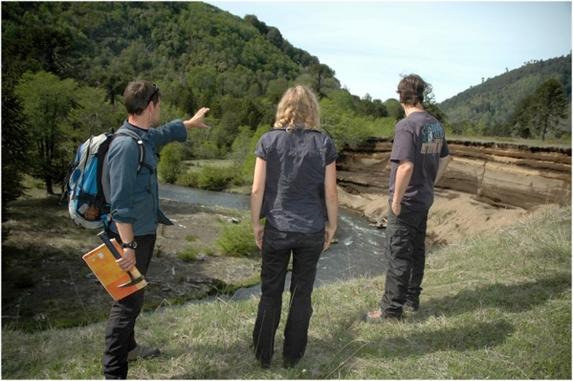
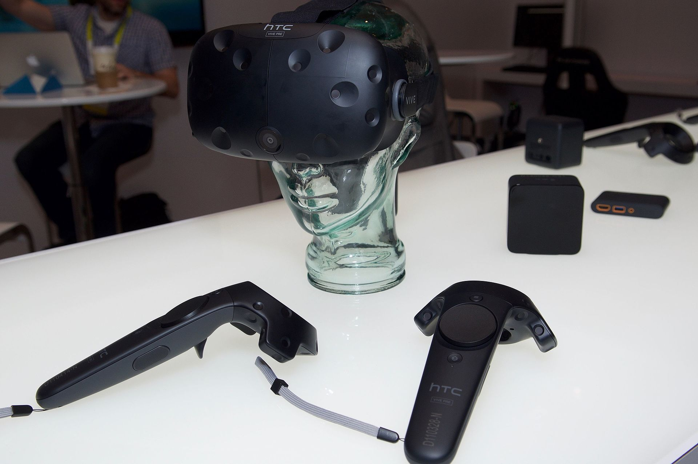
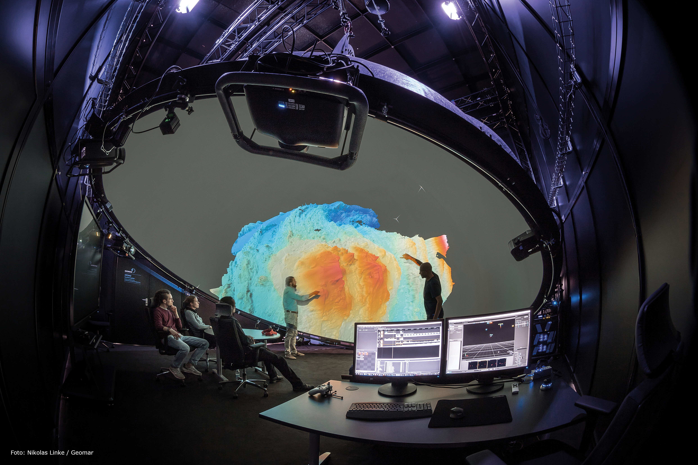
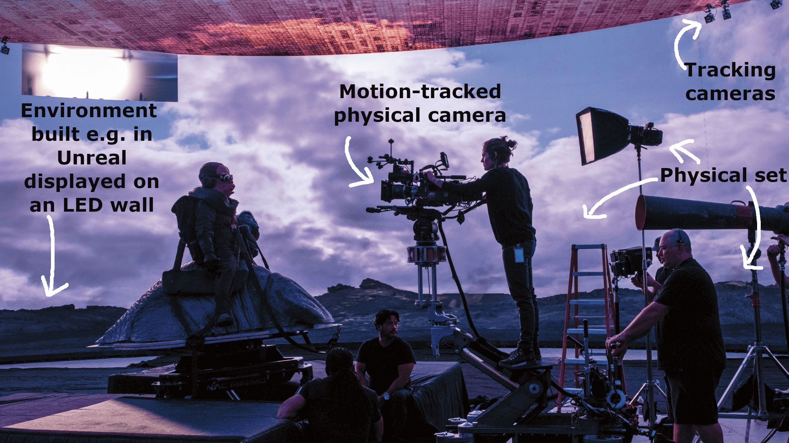
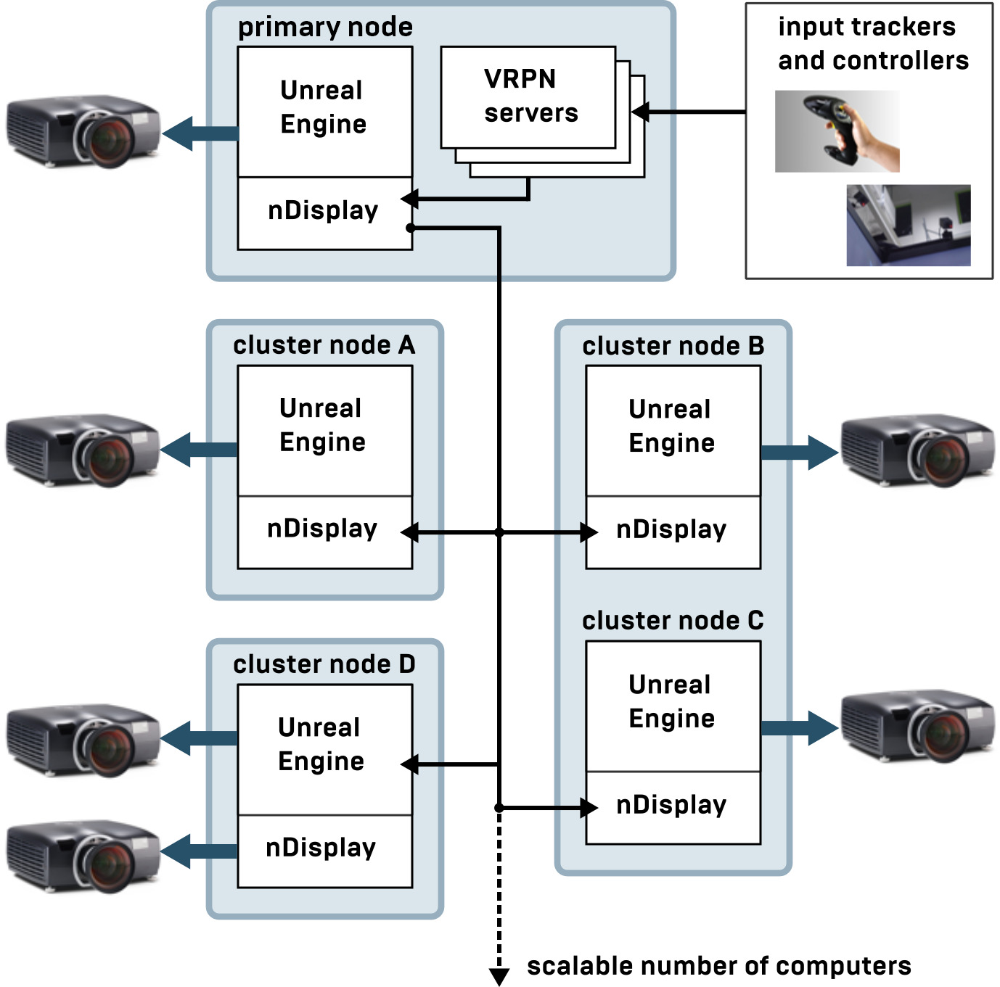
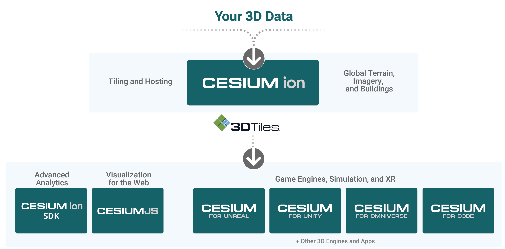
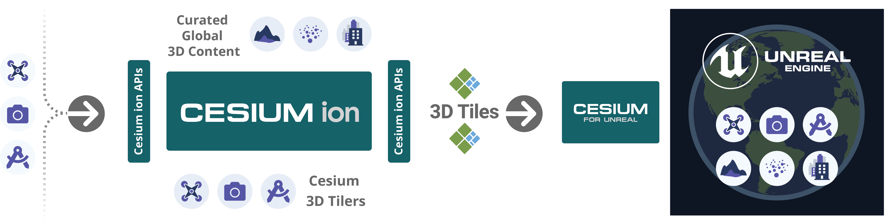
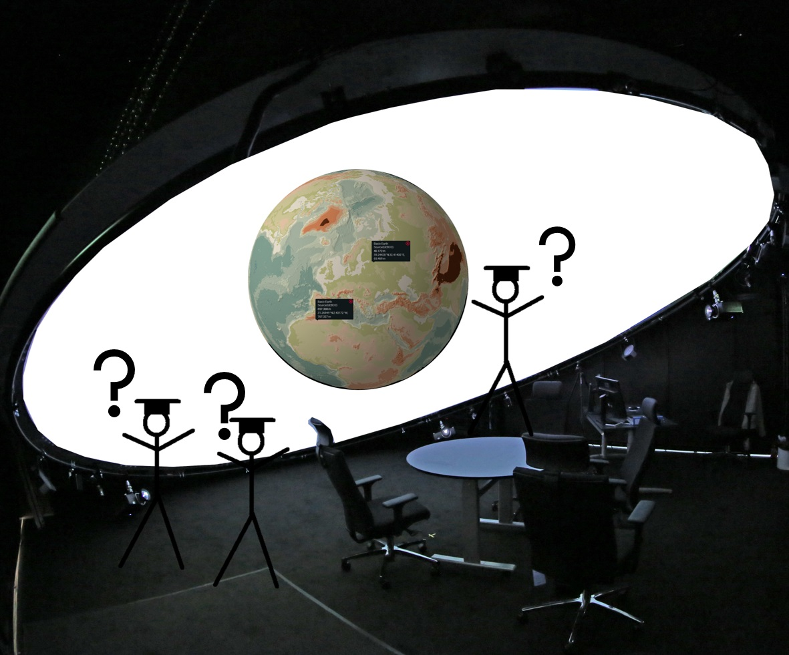
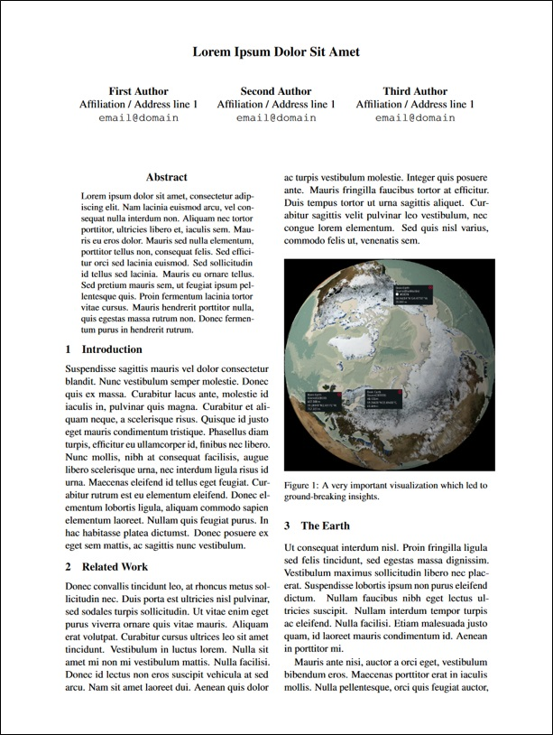
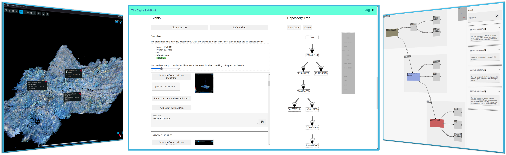

# {.columns}

## Armin Bernstetter {.left}

- M.Sc. Computer Science (University of Würzburg)
- GEOMAR Helmholtz Centre for Ocean Research Kiel
- $2^{nd}$ MarDATA cohort
- Supervision: 
  - Prof. Dr. Isabella Peters (ZBW/CAU)
  - Dr. Tom Kwasnitschka (GEOMAR)

##  {.right}

# {style="text-align:center"}

{width=30%}

# Motivation: Fieldwork

## {style="display:flex; justify-content:space-between"}
{width=33%}
)](assets/img/geocompass.jpg){width=33%}
)](assets/img/fieldnotebook.jpg){width=33%}

## How to do this on the seafloor? { .fragment}
## 🡆 Virtual fieldwork in immersive environments {.fragment}

# {.notes}

... which if we take geology as an example can at times look like this. 

You go to an outcrop, do actual measurements using actual physical tools and write down your findings in a notebook

So the question is how to do this under water?

And the answer is by doing virtual fieldwork in an immersive environment

# IMMERSIVE ANALYTICS {style="text-align:center"}

# Visual Analytics

## Data Visualization {.fragment}

Representing data in a way to be understood by humans

## + Visual Data Exploration {.fragment}

Exploring data by interacting with visualizations

## + Sensemaking {.fragment}
Gaining knowledge and insight through data exploration

<!-- Problem: How to assess the value of visualization? -->
<!-- - Value of Visualization [@vanwijk2005value] -->

## = Visual Analytics {.fragment}

# {.notes}

For our interpretation of visual analytics we have three main columns.

1. Visualizing data for humans
2. Enabling humans to explore those visualizations interactively
3. Using this interaction in a process called sensemaking which results in knowledge and insights

# Immersion {.columns}

## {.top}

>- A feeling of being **immersed** and **present** in a virtual environment
- Varying degrees and aspects of immersion (spatial immersion, 3D, head tracking ...)
- Examples: *CAVE*s, VR headsets, Domes

## {.bottom align=center .fragment style="display: inline-flex;  justify-content: space-evenly;"}

![The CAVE - Audio Visual Experience Automatic Virtual Environment. [@cruzneira1992cave]](assets/img/CAVE_Crayoland.jpg){height=25vh}
{height=25vh}

## Visual Analytics + Immersion = Immersive Analytics {.fragment}

# {.notes}

Then we have immersion which - as the name says - is about how immersed a person feels in a virtual environment.
There are different ways to achieve immersion and different implementations.

For example the original CAVE which is a square box with head tracking and 3D or a VR Headset such as the htc vive

So overall we can now add the Immersion part to our Visual Analytics

# ARENA2  {style="color:white"}

# {.notes}

At Geomar, we have the ARENA2

which is a free hanging dome with a diameter of 6 meters 

and it's using multi-projection technology for real-time interactive data visualization.

The environment of the ARENA opens up another aspect which is **collaboration**

# Collaborative Work

## Immersive Analytics {.fragment}

Visual data exploration inside an immersive virtual environment

<!-- *(@marriott2018immersive, @skarbez2019immersive, @fonnet2021survey)* -->

## + Collaborative Visual Analytics {.fragment}
<!-- *The shared use of computer-supported, (interactive) visual representations of data by more than one person with the common goal of contribution to joint information processing activities.*   -->

Joint visual data exploration by more than one person

Can be co-located or remote, synchronous or asynchronous

<!-- *(@keel2006collaborative, @heer2008design, @isenberg2011collaborative)* -->

## = ARENA2: Environment for collaborative immersive analytics {.fragment}

<!-- **Environment for co-located, synchronous collaboration in a spatially immersive setting.** -->

# {.notes}

So now we have established what Immersive Analytics is

but we can also add collaborative visual analytics to the equation

which leaves us with the ARENA2 as an environment for collaborative immersive analytics

# DEVELOPMENT FOR IMMERSIVE ANALYTICS$^*$ {style="text-align:center"}

$^*$at ARENA2

# {.notes}

and now we're taking a look at how to develop applications for immersive analytics

# Unreal Engine {.columns}

## {.left}

{width=75%}

## {.right}

- Originally video game engine
- Developed by Epic Games
- Branded as *"powerful real-time 3D creation tool"*
- Free to use, source-available software
- Ever-expanding ecosystem
- Used in game development, architecture, simulation, research, film making ...

# Virtual Production

# Unreal Engine @ ARENA2

::: {.column width=40%}

:::

::: {.column width=60%}

<h2>nDisplay Plugin</h2>

- Rendering Unreal Engine content in real-time to a cluster of nodes and multiple displays
- Tiled walls, curved screens, CAVEs, Domes (e.g. ARENA2)
- Use motion tracking and input devices (e.g. game controllers) to manipulate camera perspective and movement in scene

:::

<!-- # DOING ACTUAL SCIENCE WITH IT

# {.notes}

So that's all very nice and interesting but we're here for actual science ... -->

<!-- #  -->

# Georeferencing Data

Geospatial data from the real world needs to be in a **Coordinate Reference System** to express the location and be able to make queries that give realistic results (e.g. real distance between two points in a 3D model)

<!-- - Latitude = Elevation in degrees to the Equator
- Longitude = Azimuth in degrees to the Prime Meridian (Greenwich)
- Altitude = Height in meters to the reference ellipsoid (i.e. an approximate representation of the Earth).  -->

# {.notes}

And to be able to use geospatial data in Unreal and get results that are based in reality

we need to georeference the data

and there is a platform that helps with this which is Cesium

# Cesium

- [https://cesium.com](https://cesium.com)
- Platform for creating 3D geospatial applications and processing georeferenced 3D data

## {style="text-align:center"}
{width=100%}

# {.notes}

Cesium has a platform to host 3D geospatial data

But it also offers several plugins and APIs for building applications that are using cesium data

# Cesium for Unreal

<!-- ## {style="display:ruby; justify-content:space-between"} -->

## {style="text-align:center"}

{width=75%}
{width=75%}

# {.notes}

One of those is Cesium for unreal which for example enables you display and query photogrammetry data in unreal engine

# This means:

## 🡆 Create georeferenced virtual and immersive environments {.fragment}
## 🡆 Interactively query geospatial data in a way that yields actual scientific insight/results {.fragment}
## 🡆 Immersive Analytics {.fragment}
## 🡆 Digital Twin$^*$ {.fragment}

$^*$for people playing buzzword bingo right now

# MAKING IMMERSIVE ANALYTICS REPRODUCIBLE

# The proposed Immersive Analytics Workflow {.columns}

##  {.left .fragment}

 
 

## {.center .fragment}

 
 

## {.right .fragment}

<!-- ## There is always space for more Visualization Provenance in visual analytics workflows! {.fragment .bottom style="font-size:large"} -->
## But: If the insights and a static image of the visualization are being published, so should the process! {.fragment .bottom style="font-size:100%"}

# Provenance

## {.example .fragment}

"*[...] is information about entities, activities, and people involved in producing a piece of data or thing, which can be used to form **assessments about its quality, reliability or trustworthiness***"
 
\- World Wide Web Consortium [@2013provoverview]

# The Value of Visualization

## {.fragment}

<!-- The value is a trade-off between the costs (e.g. the effort to understand a visualization) and the gained knowledge. -->

*"Just claiming that a visualization gives insight is not enough, if we want to offer additional value."* [@vanwijk2005value]

<!-- ## {.example .fragment} -->

## Provenance and reproducibility make it possible to assess and increase the scientific value of a visualization {.fragment}

# Provenance: How-To?

>- Capture Users reasoning processes by capturing internal (i.e. in-app interaction) and external (e.g. think-aloud, manual notes) information
- Capture visualization state history and enable undo-redo and branching actions
- Organize provenance and make it persistent and publishable in a "Digital Lab Book" [@bernstetter2023practical]

# The Digital Lab Book

# 

## {style="text-align:center"}

](assets/img/ModifiedReproducibleJourney.jpg){width=90%}

# References