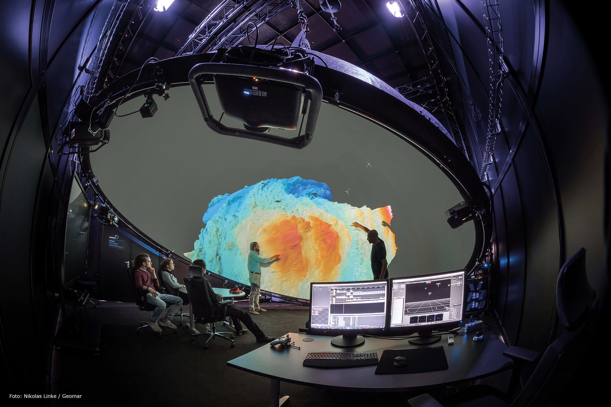

# Immersive Analytics

# ARENA2

## {style="text-align:center"}
{width=75%}

# Unreal Engine

# Virtual Production and nDisplay

# Georeferencing Data

# Cesium

# Cesium for Unreal

# 

For people playing Buzzword-Bingo right now: Digital Twin

# References