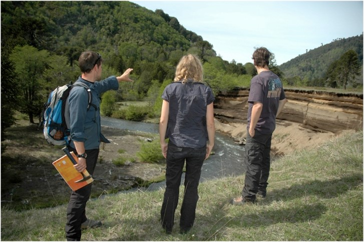
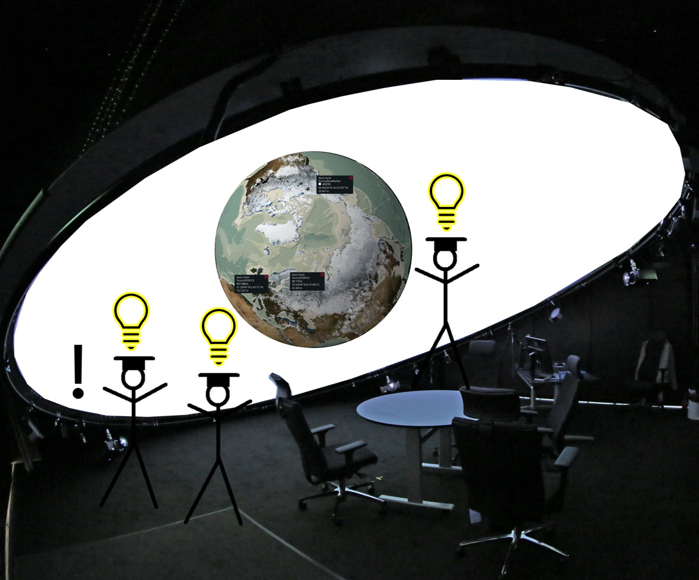

# {.columns}

## {.left style="text-align:center"}

## Armin Bernstetter {.right}

- M.Sc. Computer Science (University of Würzburg)
- GEOMAR Helmholtz Centre for Ocean Research Kiel
- MarDATA Helmholtz School for Marine Data Science
- Supervision: 
  - Prof. Dr. Isabella Peters (ZBW/CAU)
  - Dr. Tom Kwasnitschka (GEOMAR)

# IMMERSIVE ANALYTICS {style="text-align:center"}

# Visual Analytics

## Data Visualization {.fragment}

Representing data in a way to be understood by humans

## Visual Data Exploration {.fragment}

Exploring data by interacting with visualizations

## Sensemaking {.fragment}
Gaining knowledge and insight through data exploration

<!-- Problem: How to assess the value of visualization? -->
<!-- - Value of Visualization [@vanwijk2005value] -->

# {.notes}

Overall, we are located in the area of Human-Computer Interaction or Human-Data Interaction. I will not go fully into detail here because the terms themselves are self-explanatory enough for this talk.

In contrast to e.g. automated data analytics by machine learning or other computer-based techniques, visual analytics is performed by humans through interaction with visualized data.

# Immersion {.columns}

## {.top}

>- A feeling of being **immersed** and **present** in a virtual environment
- Varying degrees and aspects of immersion (spatial immersion, 3D/stereoscopy, head tracking, surround sound, ...)
- Examples: *CAVE*s, Head-Mounted Displays, Domes (e.g. *ARENA2*)

## {.bottom align=center .fragment style="display: inline-flex;  justify-content: space-evenly;"}

![The CAVE - Audio Visual Experience Automatic Virtual Environment. [@cruzneira1992cave]](assets/img/CAVE_Crayoland.jpg){width=30%}
{width=30%}

<!-- # ARENA2 Visualization Lab {.columns .fragments style="text-align:center"} -->
# ARENA2  {style="color:white"}

# Immersive and Collaborative Visual Analytics

## Immersive Analytics {.fragment}

Visual data exploration inside an immersive virtual environment

<!-- *(@marriott2018immersive, @skarbez2019immersive, @fonnet2021survey)* -->

## Collaborative Visual Analytics {.fragment}
<!-- *The shared use of computer-supported, (interactive) visual representations of data by more than one person with the common goal of contribution to joint information processing activities.*   -->

Joint visual data exploration by more than one person

Can be co-located or not, synchronous or asynchronous

<!-- *(@keel2006collaborative, @heer2008design, @isenberg2011collaborative)* -->

## ARENA2 {.example .fragment}

**Environment for co-located, synchronous collaboration inside a spatially immersive setting.**

# DEVELOPMENT FOR IMMERSIVE ANALYTICS$^*$ {style="text-align:center"}

$^*$at ARENA2

# Unreal Engine {.columns}

## {.left}

{width=75%}

## {.right}

- Originally a video game engine
- Developed by Epic Games
- Today branded as *"powerful real-time 3D creation tool"*
- Free to use, source-available software
- Huge ecosystem
- Used in game development, architecture, simulation, research, film making ...

# Virtual Production

# Virtual Production Technology

::: {.column width=40%}

:::

::: {.column width=60%}

<h2>nDisplay Plugin</h2>

- Rendering Unreal Engine content in real-time to a cluster of nodes and multiple displays
- Tiled walls, curved screens, CAVEs, Domes (e.g. ARENA2)
- Use motion tracking and input devices (e.g. game controllers) to manipulate camera perspective and movement in scene

:::

# DOING ACTUAL SCIENCE WITH IT

# 

# Fieldwork in Geology

## {style="display:flex; justify-content:space-between"}
{width=33%}
)](../assets/img/geocompass.jpg){width=33%}
)](../assets/img/fieldnotebook.jpg){width=33%}

## How to do this under water? { .fragment}
## 🡆 Virtual fieldwork in immersive environments {.fragment}

# Georeferencing Data

Geospatial data from the real world needs to be in a **Coordinate Reference System** to express the location and be able to make queries that give realistic results (e.g. real distance between two points in a 3D model)

- Latitude = Elevation in degrees to the Equator
- Longitude = Azimuth in degrees to the Prime Meridian (Greenwich)
- Altitude = Height in meters to the reference ellipsoid (i.e. an approximate representation of the Earth). 

# Cesium

- [https://cesium.com](https://cesium.com)
- Platform for creating 3D geospatial applications and processing georeferenced 3D data

## {style="text-align:center"}
{width=75%}

# Cesium for Unreal

<!-- ## {style="display:ruby; justify-content:space-between"} -->

## {style="text-align:center"}

{width=70%}
{width=70%}

# What does this mean?

## 🡆 Create georeferenced virtual and immersive environments {.fragment}
## 🡆 Interactively query geospatial data in a way that yields actual scientific insight/results {.fragment}
## 🡆 Immersive Analytics {.fragment}
## 🡆 Digital Twin$^*$ {.fragment}

$^*$for people playing buzzword bingo right now

# REPRODUCIBILITY AND PROVENANCE

# The proposed Immersive Analytics Workflow {.columns}

##  {.left .fragment}

 
 

## {.center .fragment}

 
 

## {.right .fragment}

<!-- ## There is always space for more Visualization Provenance in visual analytics workflows! {.fragment .bottom style="font-size:large"} -->
## But: If the insights and a static image of the visualization are being published, so should the process! {.fragment .bottom style="font-size:100%"}

# Provenance

## {.example .fragment}

"*[...] is information about entities, activities, and people involved in producing a piece of data or thing, which can be used to form **assessments about its quality, reliability or trustworthiness***"
 
\- World Wide Web Consortium [@2013provoverview]

# The Value of Visualization

##

The value is a trade-off between the costs (e.g. the effort to understand a visualization) and the gained knowledge.

*"Just claiming that a visualization gives insight is not enough, if we want to offer additional value."* [@vanwijk2005value]

<!-- ## {.example .fragment} -->

## Provenance and reproducibility make it possible to assess and increase the scientific value of a visualization {.fragment}

>- Capture Users reasoning processes by capturing internal (i.e. in-app interaction) and external (e.g. think-aloud, manual notes) information
- Capture visualization state history including undo-redo and branching actions
- Organize provenance and make it persistent and publishable in a "Digital Lab Book" [@bernstetter2023practical]

# The Digital Lab Book

# 

## {style="text-align:center"}

](assets/img/ModifiedReproducibleJourney.jpg){width=65%}

# References